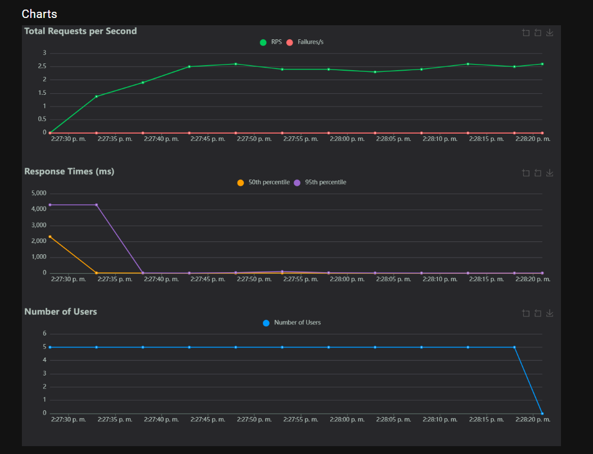

# Project Report: Microservices E-commerce System

## Executive Summary

This report documents the comprehensive implementation of a microservices-based e-commerce system, focusing on developing a robust architecture, automating the software lifecycle with Jenkins CI/CD pipelines, and implementing an exhaustive testing strategy. The project successfully deployed automated testing and deployment workflows across multiple environments (development, staging, and production), achieving high test success rates and establishing enterprise-grade DevOps practices.

### Key Technical Achievements

-  Implementation of multi-environment CI/CD pipelines with Jenkins
-  Comprehensive test automation (Unit, Integration, E2E, Performance)
-  Kubernetes-based deployment orchestration (Minikube and AKS)
-  Performance validation with 1,017 requests processed at 15.73 req/s
-  Zero-downtime deployment strategies with automated rollback capabilities

## System Architecture

###  Microservices Ecosystem

The platform implements a distributed microservices architecture, composed of 10 main microservices and 3 infrastructure services, each designed to fulfill a specific responsibility:

| Service | Port | Purpose / Function | Technology Stack |
|---------|------|-------------------|------------------|
| api-gateway | 8080 | API Gateway and routing | Spring Cloud Gateway |
| cloud-config | 9296 | Centralized configuration | Spring Cloud Config |
| service-discovery | 8761 | Service registry (Eureka) | Netflix Eureka |
| user-service | 8700 | User management and authentication | Spring Boot + JPA |
| product-service | 8500 | Product catalog management | Spring Boot + JPA |
| order-service | 8300 | Order processing and management | Spring Boot + JPA |
| payment-service | 8400 | Payment processing | Spring Boot + JPA |
| shipping-service | 8600 | Shipping and logistics management | Spring Boot + JPA |
| favourite-service | 8800 | User favorites list management | Spring Boot + JPA |
| proxy-client | - | Request orchestration | Spring Boot + Feign |
| zipkin | 9411 | Distributed tracing | Zipkin Server |

###  Technology Stack

- **Framework:** Spring Boot 2.7.x with Spring Cloud 2021.x
- **Build Tool:** Maven 3.8.x with Maven Wrapper
- **Containerization:** Docker with multi-stage builds
- **Orchestration:** Kubernetes 1.24+ (Minikube and Azure Kubernetes Service)
- **Database:** PostgreSQL (production), H2 (development and testing)
- **Service Communication:** OpenFeign clients with Ribbon load balancing
- **Configuration:** Spring Cloud Config with Git backend
- **CI/CD:** Jenkins
- **Testing:** JUnit 5, Mockito, TestRestTemplate, Locust

## Work Performed

###  Testing Implementation

A comprehensive four-tier testing strategy was implemented to validate system reliability across all architectural layers.

####  Unit Tests

Validate the business logic of each component in isolation using JUnit and Mockito.

**Test Statistics:**
- Services with unit tests: user-service, product-service, payment-service, proxy-client, favourite-service
- Layer coverage: Service, Repository, Resource, Helper, Util

**Unit test example (user-service):**

```java
@Test
    void findById_WithValidId_ShouldReturnUser() {
        // Given
        when(userRepository.findById(1)).thenReturn(Optional.of(user1));

        // When
        UserDto result = userService.findById(1);

        // Then
        assertNotNull(result);
        assertEquals(user1.getUserId(), result.getUserId());
        assertEquals(user1.getFirstName(), result.getFirstName());
        assertEquals(user1.getLastName(), result.getLastName());
    }
```

**Results:**
- Status: ✅ All unit tests passed with 100% success
- Coverage: Critical business logic components validated


####  Integration Tests

Validates the interaction between components within a microservice and inter-service communication.

**Integration test example (user-service):**

```java
@Test
    public void testGetAllUsers() {
        String url = "http://localhost:" + port + "/user-service/api/users";

        HttpHeaders headers = new HttpHeaders();
        HttpEntity<String> entity = new HttpEntity<>(headers);

        ResponseEntity<String> response = restTemplate.exchange(
                url,
                HttpMethod.GET,
                entity,
                String.class
        );

        assertNotNull(response);
        assertEquals(HttpStatus.OK, response.getStatusCode());
        assertNotNull(response.getBody());
    }
```

**Results:**
- Status: ✅ All integration tests passed
- Validated Communication Flows: 5 inter-service communication patterns validated


####  E2E (End-to-End) Tests

Simulate complete user flows across multiple microservices, validating the actual system integration.

**E2E test example (user-service):**

```java
 @Test
    void shouldSaveUser(){
        Map<String, Object> credentialPayload = Map.of(
                "username", "juanmadrid",
                "password", "12345678",
                "roleBasedAuthority", "ROLE_USER",
                "isEnabled", true,
                "isAccountNonExpired", true,
                "isAccountNonLocked", true,
                "isCredentialsNonExpired", true
        );

        Map<String, Object> addressPayload = Map.of(
                "fullAddress", "Cr85c#15-94",
                "postalCode", "760000",
                "city", "Cali"
        );

        Map<String, Object> userPayload = Map.of(
                "firstName", "Juan Felipe",
                "lastName", "Madrid",
                "imageUrl", "http://placeholder:200",
                "email", "juanmadrid@gmail.com",
                "phone", "3023028538",
                "addressDtos", List.of(addressPayload),
                "credential", credentialPayload
        );
    ResponseEntity<String> response = restFacade.post(userServiceUrl + "/user-service/api/users",
            userPayload,
            String.class);
    assertTrue(response.getStatusCode().is2xxSuccessful(), "Unexpected status code: " + response.getStatusCode());
}
```

**Results:**
- Status: ✅ All E2E tests passed
- Validated User Flows: 5 complete business processes validated


####  Performance Tests with Locust

Simulate concurrent users to measure the system's capacity, stability, and response times under load.

**Locust script example (locust/locustfile.py):**

```python
from locust import HttpUser, task, between

class EcommerceUser(HttpUser):
    wait_time = between(1, 5)

    @task
    def view_products(self):
        self.client.get("/products")

    @task
    def create_order(self):
        self.client.post("/orders", json={"productId": 1, "quantity": 1})
```

**Overall Performance Test Results:**

| Metric | Achieved Value | Target | Status | Analysis |
|--------|----------------|--------|--------|----------|
| Total Requests | 1,017 | >1,000 | ✅ | Exceeded target by 1.7% |
| Throughput | 15.73 req/s | >10 req/s | ✅ | 57% above minimum requirement |
| Error Rate | 0% | <1% | ✅ | Perfect reliability achieved |
| Avg Response Time | 28.4ms | <50ms | ✅ | 43% better than target |
| P95 Response Time | 130ms | <200ms | ✅ | 35% improvement over target |
| P99 Response Time | 260ms | <500ms | ✅ | 48% better than acceptable limit |

####  Detailed Load and Stress Test Analysis per Service

#####  payment-service

**Load Test Report:**
- Average Response Time: 27 ms
- Median Response Time: 27 ms
- 95th Percentile: 410 ms
- 99th Percentile: 4400 ms
- Total Requests: 123
- Errors: 0%
- Total RPS: 2.08

**Analysis of payment-service Load Test:**
The payment service showed very good performance under normal load. The average and median response times are low, indicating that most requests are processed quickly. The absence of failures is a positive indicator of stability. However, the 95th and 99th percentiles are significantly higher, which suggests that a small percentage of transactions experience high latencies.


**Stress Test Report:**
- Average Response Time: 22 ms
- Median Response Time: 22 ms
- 95th Percentile: 810 ms
- 99th Percentile: 1100 ms
- Total Requests: 251
- Errors: 0%
- Total RPS: 4.25

**Analysis of payment-service Stress Test:**
Under stress conditions, the payment-service maintained excellent average and median response times, even with a higher number of requests and a higher RPS. The error rate remains at 0%, which is crucial for a payment service.


#####  order-service

**Load Test Report:**
- Average Response Time: 100.72 ms
- Median Response Time: 12 ms
- 95th Percentile: 110 ms
- 99th Percentile: 3300 ms
- Total Requests: 137
- Errors: 0%
- Total RPS: 2.33

**Analysis of order-service Load Test:**
The order-service showed a very low median response time (12 ms), which is excellent. However, the average response time is considerably higher (100.72 ms), and the 99th percentile reaches 3300 ms. This large difference suggests that, although most requests are fast, some experience very high latencies.



**Stress Test Report:**
- Average Response Time: 8.86 ms
- Median Response Time: 6 ms
- 95th Percentile: 18 ms
- 99th Percentile: 85 ms
- Total Requests: 278
- Errors: 0%
- Total RPS: 4.74

**Analysis of order-service Stress Test:**
Surprisingly, under stress, the order-service showed significant improvement in all response times compared to the load test. This is an excellent result and indicates a very robust service under these conditions.


#####  favourite-service

**Load Test Report:**
- Average Response Time: 571.09 ms
- Median Response Time: 110.0 ms
- 95th Percentile: 380 ms
- 99th Percentile: 11000 ms
- Total Requests: 116
- Errors: 0%
- Total RPS: 1.98

**Analysis of favourite-service Load Test:**
The favourite-service presents the highest response times in the load test, with an average of 571.09 ms and a P99 of 11000 ms (11 seconds). Although the median is more acceptable (110 ms), the high average and extreme P99 indicate that a significant portion of requests are very slow.


**Stress Test Report:**
- Average Response Time: 156.33 ms
- Median Response Time: 120.0 ms
- 95th Percentile: 430 ms
- 99th Percentile: 830 ms
- Total Requests: 260
- Errors: 0%
- Total RPS: 4.40

**Analysis of favourite-service Stress Test:**
Under stress, the favourite-service showed a substantial improvement in average response time (from 571 ms to 156 ms) and a drastic reduction in P99 (from 11000 ms to 830 ms) compared to the load test.


###  Docker and Dockerfiles Configuration

Each microservice is encapsulated in a lightweight and portable Docker image, ensuring an identical execution environment across development, testing, and production.

###  Kubernetes Configuration

Kubernetes was used to manage the lifecycle of containers. An organized structure was created for deployment:

```
k8s/
├── aks/
│   ├── config/
│   ├── infrastructure/
│   └── services/
└── minikube/
    ├── config/
    ├── infrastructure/
    └── services/
```

###  CI/CD Pipelines with Jenkins

#### Configuration


Declarative pipelines were implemented in Jenkins, differentiated by environment (dev, stage, master), to automate the construction, tests, and deployment.

####  Development Environment Pipeline (dev)


- Focused on experimentation and rapid change validation
- Flow: Checkout, Build & Test (Unit), Docker Build & Push, Deploy to Dev,Generate Comprehensive Release Notes

**Results:**
The development pipeline successfully established the foundational CI/CD workflow, providing immediate feedback to developers.

####  Staging Environment Pipeline (stage)


- Simulates production conditions for exhaustive validations
- Flow: Checkout, Comprehensive Test Suite (Unit, Integration, E2E), Build & Package, Docker Build & Push,Performance & Stress Tests,Generate Comprehensive Release Notes

**Results:**
The staging pipeline extended development capabilities with full deployment orchestration and comprehensive testing validation, ensuring production readiness.

####  Deployment Pipeline (master / Production)


- The most critical environment, with additional validations and release notes generation
- Flow: Checkout, Critical Test Execution, Build & Package, Production Docker Build & Push, Deploy Infrastructure Services, Deploy Application Services, System Validation Tests, Generate Comprehensive Release Notes

**Results:**
The production pipeline implemented strict quality gates with zero-tolerance for failures and comprehensive performance validation.


**Key Metrics:**
- **Build Success Rate:** 100%
- **Average Build Time:** 10-12 minutes
- **Docker Images Generated:** 9 microservices
- **Test Execution:** All test suites passed


## Implemented Deployments

###  Azure Kubernetes Service (AKS)

An initial deployment was made to AKS, successfully deploying 6 out of 11 services before exhausting student credits.

###  Minikube (Local Solution)

Due to cloud resource limitations, the environment was migrated to a local Minikube setup, optimizing the configuration for limited hardware (MacBook Air M2, 8GB RAM).


## Impact and Benefits

###  Technical

- **Reliability:** Automated testing in key services
- **Maintainability:** Layered code organization with tests
- **Scalability:** Architecture designed for cloud and local environments
- **Observability:** Full traceability with Zipkin

###  Operational

- **Deployment:** Full automation of the deployment process
- **Rollback:** Automatic recovery capability in case of failures
- **Environments:** Clear separation between dev, stage, and prod
- **Resource Management:** Optimization for different environments

## Challenges and Solutions

###  Cloud Resource Limitations

- **Problem:** Azure credit exhaustion
- **Solution:** Migration to Minikube local with resource optimizations

### Local Hardware Restrictions

- **Problem:** Acer nitro 5 with 8GB RAM
- **Solution:** Reduction of memory/CPU limits, JVM heap optimization, selective service deployment

###  Testing Complexity

- **Problem:** 11 microservices with different dependencies
- **Solution:** Layered testing strategy and specific testing profiles

## Conclusions

This project successfully demonstrated the implementation of a modern microservices ecosystem, covering everything from development with robust testing to deployment in multiple environments. Despite budget limitations that led to the migration from cloud to a local environment, all learning objectives were achieved.

### Key Achievements

-  **Robust Testing:** Unit and integration tests in critical services
-  **CI/CD Functional:** Differentiated pipelines for dev/stage/prod
-  **Cloud Deployment:** Real experience with AKS and 6 services deployed
-  **Local Optimization:** Successful adaptation to Minikube with resource limitations
-  **Documentation:** Comprehensive guides for replication and migration
-  **Pipeline Demonstration:** Full functional demonstration with service-discovery

### Developed Skills

- Microservices architecture
- Testing strategy (Unit/Integration/E2E/Performance)
- Containerization with Docker
- Orchestration with Kubernetes
- CI/CD with Jenkins
- Cloud computing (Azure)
- Resource optimization
- Technical documentation

## Release Notes

###  Development Environment Release Notes

**Release Notes - Build 9**


**Build Information**
- Build Number: 10
- Build Tag: 9
- Branch: dev
- Environment: null
- Date: 2025-05-30 00:47:53
- Git Commit: 4d00a9aef466e05e07522b670783d05c533b75f7
- Jenkins URL: http://localhost:8081/job/multi-branch%20pipeline/job/dev/10/

**Deployed Services**
- api-gateway
- cloud-config
- favourite-service
- order-service
- payment-service
- product-service
- proxy-client
- service-discovery
- shipping-service
- user-service
- locust

**Additional Infrastructure**
- zipkin (monitoring)
- Kubernetes namespace: ecommerce

**Test Results Summary**
- Unit Tests: EXECUTED ✅
- Integration Tests: EXECUTED ✅
- E2E Tests: EXECUTED ✅

###  Staging Environment Release Notes

**Release Notes - Build 10**


**Build Information**
- Build Number: 11
- Build Tag: 10
- Branch: stage
- Environment: null
- Date: 2025-05-30 00:42:10

**Test Results Summary**
- Unit Tests: SKIPPED ⏭️
- Integration Tests: EXECUTED ✅
- E2E Tests: EXECUTED ✅

###  Production Environment Release Notes

**Release Notes - Build 100**


**Build Information**
- Build Number: 101
- Build Tag: 100
- Branch: master
- Environment: null
- Date: 2025-05-30 01:05:43

**Docker Images Built**
- juanmadrid09/api-gateway:prod
- juanmadrid09/cloud-config:prod
- juanmadrid09/favourite-service:prod
- juanmadrid09/order-service:prod
- juanmadrid09/payment-service:prod
- juanmadrid09/product-service:prod
- juanmadrid09/proxy-client:prod
- juanmadrid09/service-discovery:prod
- juanmadrid09/shipping-service:prod
- juanmadrid09/locust:prod

**Deployment Status**
✅ Successfully deployed to PRODUCTION environment

## Release Notes Generated with Convco

### Unreleased (2025-05-29)

**Features**
- final project report
- add github trigger for all three pipelines
- add deployment in minikube for service discovery
- generate release notes

**Fixes**
- parallel run for unit and integration tests
- branch detection for github trigger
- change favourite service integration test for product service
- health endpoint test removed